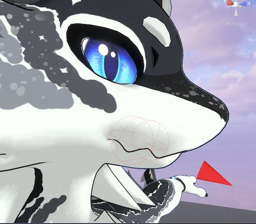
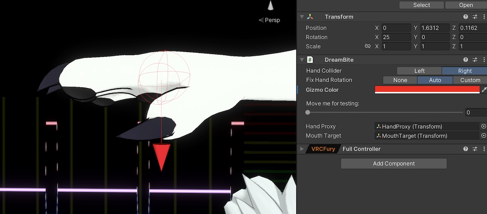

# DreamBite (Русский)

[English Version](README.md)

**DreamBite - теперь твой аватар умеет кусаться!** \
Хватай друзей за уши, хвосты и всё, что попадется под руку (точнее - под рот).

Это open-source решение для взаимодействия с PhysBones, которое настраивается за пару минут:
закинул префаб, подогнал позицию рта и готово! \
Работает с фейстрекингом и без.

https://github.com/user-attachments/assets/66449eeb-d040-489c-89da-a026e0b159fa

## Скачать
Последнюю версию можно найти в разделе [релизов на GitHub](https://github.com/ghostiam/DreamBite/releases)

## Что понадобится
- [VRChat SDK3](https://vrchat.com/home/download)
- [VRFury](https://vrcfury.com)

## Как настроить
1. Импортируй `unitypackage` в свой проект.
2. Перетащи префаб `DreamBite` из папки `Assets/GhostIAm/DreamBite` на своего аватара.
3. Отрегулируй коллайдер, чтобы он находился внутри рта, а стрелка была направлена наружу. \
   
4. Убедись, что стрелка коллайдера на выбранной руке показывает в сторону сжатия ладони. Если это не так, в настройках компонента выбери `Custom` вместо `Auto` и настрой вручную. \
   
5. Готово!

## Использование с отслеживанием лица (Face Tracking)
Для работы необходимо запустить внешнее приложение `DreamBiteApp` (входит в архив с unitypackage).

**Как схватить:**
1. Разожми ладонь (жест "открытая ладонь").
2. Открой рот на полсекунды (можно настроить, длительность равна длине анимации `DreamBiteDelay`).
3. Закрой рот. Если включен звук, то услышишь "кусь".

**Как отпустить:**
1. Просто открой рот.

## Использование без отслеживания лица (вручную)
1. Открой круговое меню (Radial Menu).
2. Выбери `DreamBite`.
3. Включи `Manual enable`.
4. Включи `Manual Move Collider`. Это переместит область захвата с руки в рот.
> \[!NOTE\]
> Теперь ты не сможешь хватать рукой, но при сжатии контроллера захват будет происходить ртом.

## Участие в разработке
Буду рад любой помощи! Вы можете:
- [Сообщить об ошибке](https://github.com/ghostiam/DreamBite/issues) или предложить новую функцию.
- Создать [Pull Request](https://github.com/ghostiam/DreamBite/pulls) с вашими улучшениями.

## Использование и авторство
Вы можете свободно использовать этот ассет, в том числе на аватарах для продажи.
- **Разрешено:** Ставить на коммерческие аватары, изменять и использовать в любых проектах.
- **Запрещено:** Выдавать этот ассет или его части за свою разработку.

Указание авторства (ссылка на этот репозиторий) не является обязательным, но я буду очень благодарен!

## Лицензия
Этот проект распространяется под лицензией [MIT](LICENSE).
